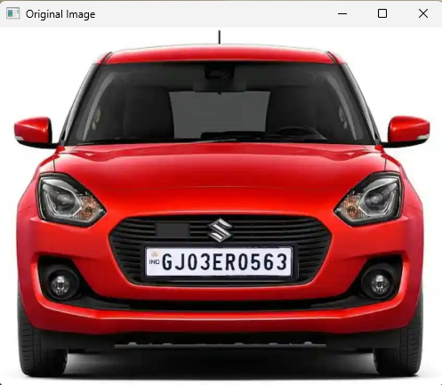
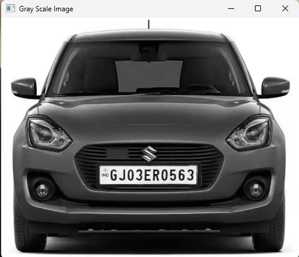
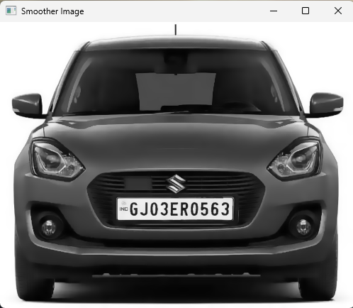
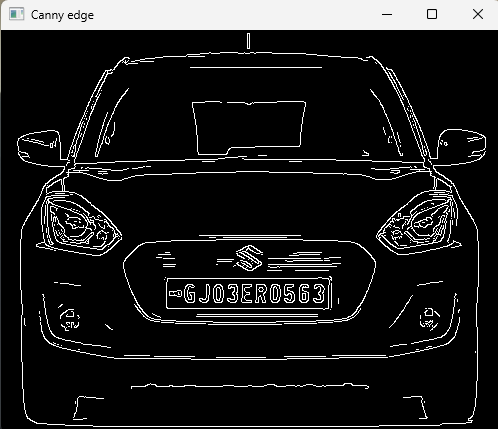
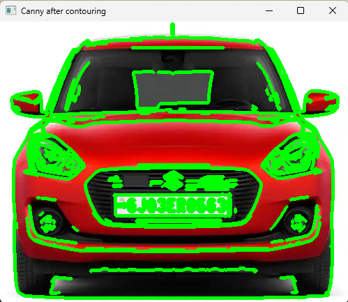
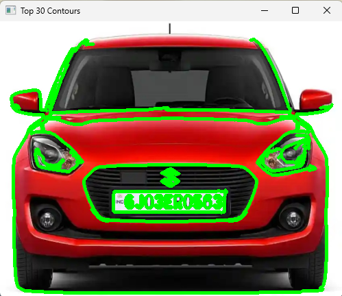
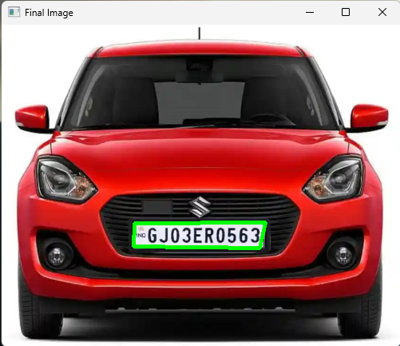
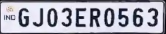

# 🚘 Number Plate Detection using OpenCV and Contour Analysis 📷

This project demonstrates how to **detect number plates from vehicle images** using OpenCV in Python. The core technique revolves around **edge detection**, **contour analysis**, and **image preprocessing**, making it an effective lightweight solution for automated license plate localization.

---

## 📌 Key Features

- 📸 Automatically detects number plates from static images
- 🔍 Uses Canny edge detection and contour hierarchy
- 🧠 Filters contours by shape approximation (looking for rectangles)
- ✂️ Crops and saves the detected number plate
- 🖼 Step-by-step image visualization using `cv2.imshow`

---

## 🛠 Tech Stack

- **Python 3**
- **OpenCV** – for computer vision tasks
- **imutils** – for image resizing and convenience functions
- **NumPy** – array manipulation

---

## 📂 Project Structure

```

number-plate-detection/
├── result.jpeg             # Input image for detection
├── 1.png                   # Output cropped number plate
├── start.py                 # Main detection script
├── requirements.txt        # Project dependencies
└── README.md               # This file

````

---

## ▶️ How it Works (Logic Overview)

1. **Load and Resize Image** – Resize to width 500px for consistency.
2. **Grayscale Conversion** – Simplifies processing.
3. **Noise Reduction** – Bilateral filtering for better edge detection.
4. **Edge Detection** – Canny edge detection highlights object boundaries.
5. **Contour Detection** – Finds all contours in the image.
6. **Contour Sorting & Filtering** – Keeps top 30 by area; looks for quadrilateral shapes.
7. **Bounding Box & Cropping** – If a rectangular contour is found, crop it and save.

---


## 📷 Output Example

<div align="center">

| **Stage**                       | **Image**                                | **Description**                                                                                       |
| ------------------------------- | ---------------------------------------- | ----------------------------------------------------------------------------------------------------- |
| **Original Image**              |         | Input image of the vehicle to begin number plate detection process.                                   |
| **Gray Scale Image**            |           | Converted to grayscale to reduce complexity for further processing like filtering and edge detection. |
| **Smoother Image**              |           | Applied bilateral filter to smoothen the image and reduce noise while preserving edges.               |
| **Canny Edge Detection**        |                | Canny edge detection highlights sharp changes in intensity to identify potential plate boundaries.    |
| **Canny After Contouring**      |  | Contours drawn on Canny edge image to visualize all shape boundaries for further filtering.           |
| **Top 30 Contours**             |            | Top 30 contours by area selected to narrow down potential number plate candidates.                    |
| **Final Detected Plate in Car** |               | Best matching quadrilateral contour highlighted — likely to be the number plate area.                 |
| **Cropped Number Plate**        |              | Number plate region cropped from the original image for final result.                                 |

</div>


---

## 🧪 Installation & Setup

### 📥 Step 1: Clone the Repository

```bash
git clone https://github.com/yourusername/number-plate-detection.git
cd number-plate-detection
````

### 🧱 Step 2: Set up Virtual Environment

```bash
python -m venv venv
venv\Scripts\activate     # On Windows
```

### 📦 Step 3: Install Dependencies

```bash
pip install -r requirements.txt
```

OR install manually:

```bash
pip install opencv-python
pip install imutils
```

### 🔒 Step 4: Freeze for Deployment

```bash
pip freeze > requirements.txt
```

---

## 🧾 Requirements (`requirements.txt`)

```
imutils==0.5.4
numpy==2.3.1
opencv-python==4.11.0.86
```

---

## 🚀 Running the Code

Make sure your input image is named `result.jpeg` and placed in the same folder as `main.py`. Then, run:

```bash
python main.py
```

You'll see several pop-up windows displaying each stage of the process — from grayscale conversion to the final cropped number plate.

---

## 📬 Output

* The cropped image of the detected number plate will be saved as `1.png`.
* The original image will be annotated with a green box around the detected plate.

---

## 🛠 Troubleshooting

* Ensure `result.jpeg` is a clear image with a visible number plate.
* Run the script in an environment that supports `cv2.imshow()` (e.g., local terminal, not headless).
* Adjust `cv2.Canny()` thresholds and contour filters if detection is not accurate.

---

## 🙋‍♂️ About Me

I'm **Ayush Yadav**, a passionate developer with an interest in computer vision, automation, and innovative tech solutions.
Always exploring new technologies and building things that matter.

### Let’s connect:

* 📧 **Email:** [officialayushyadav15@gmail.com](mailto:officialayushyadav15@gmail.com)
* 💼 **GitHub:** [@officialayushyadav15](https://github.com/officialayushyadav15)
* 🔗 **LinkedIn:** [Ayush Yadav](https://www.linkedin.com/in/ayush-yadav-408924230/)

---

## 🤝 Contributions

Feel free to fork this project, raise issues, or submit pull requests. Suggestions and improvements are always welcome!

---

### 🎯 Happy Coding and Plate Detecting! 🔍🚗


